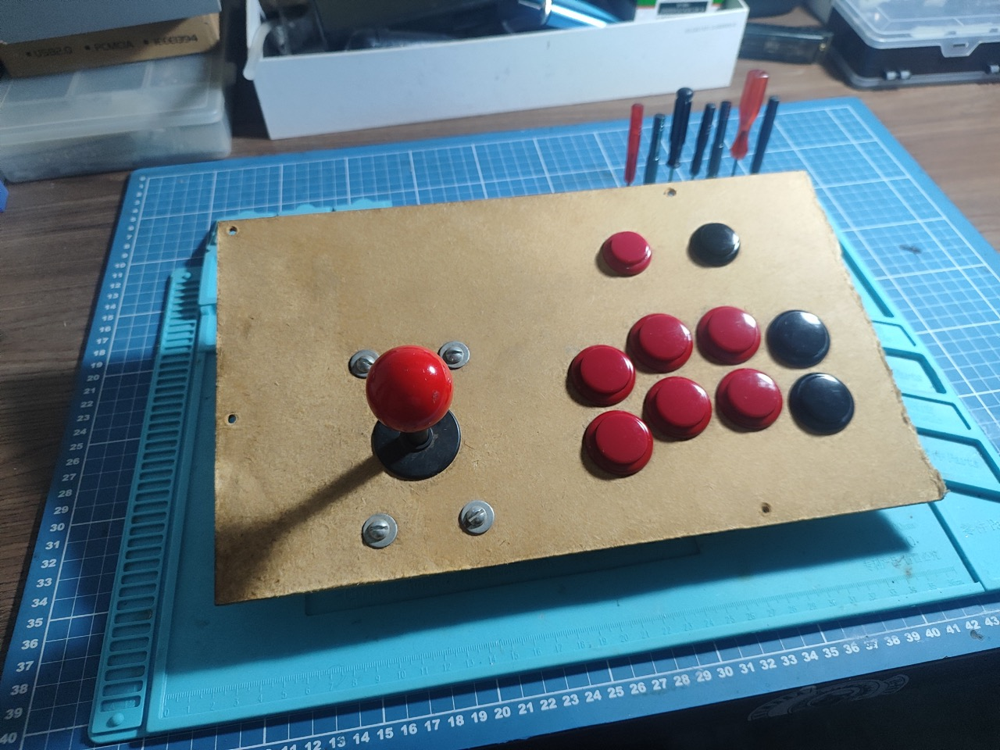
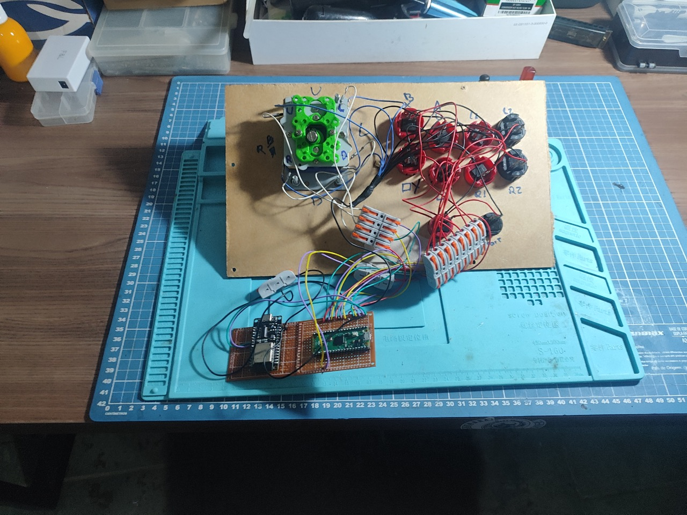
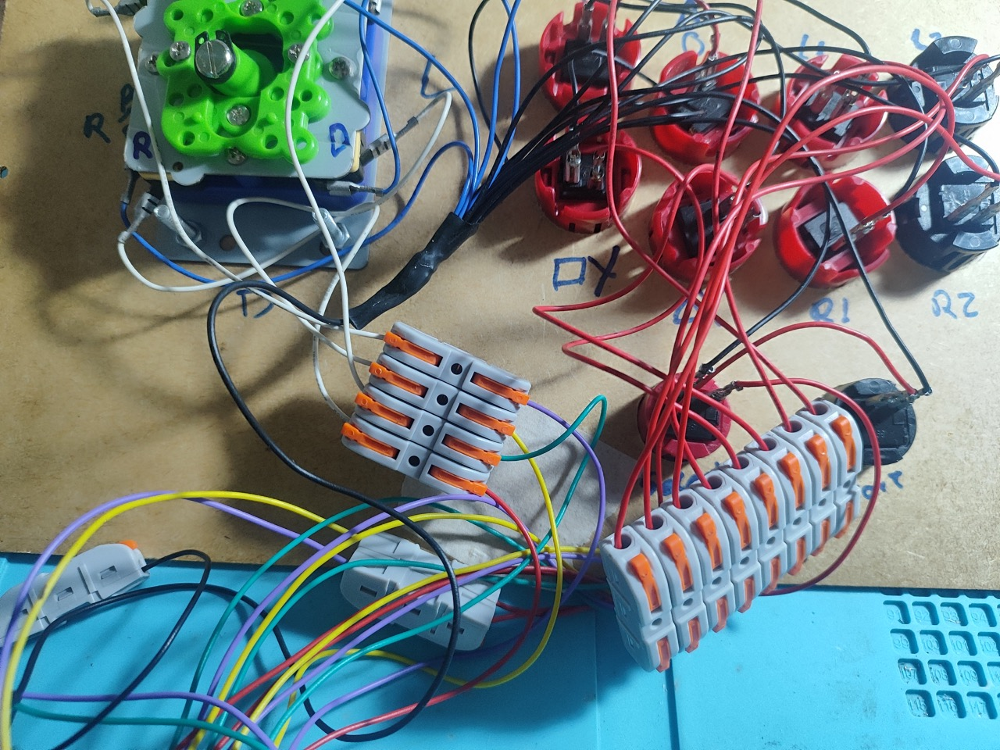
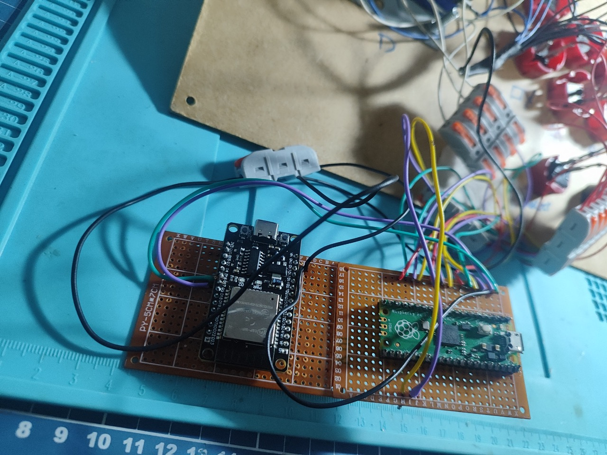
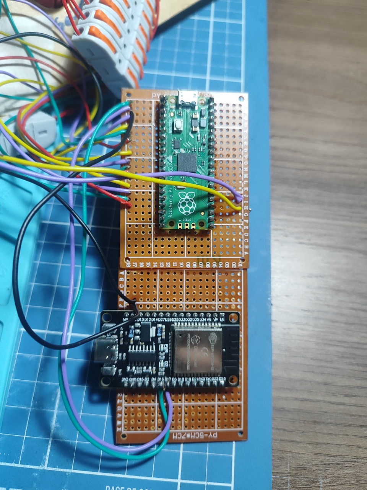

# Prototype – 001

>After some breadboard testing, we have our first prototype

***

## The Joystick

| The Joystick | Backside mess |
|---|---|
|  |  |

| Organized wiring | The Controllers |
|---|---|
|  |  |

| Board View | Board View |
|---|---|
|  |  |
